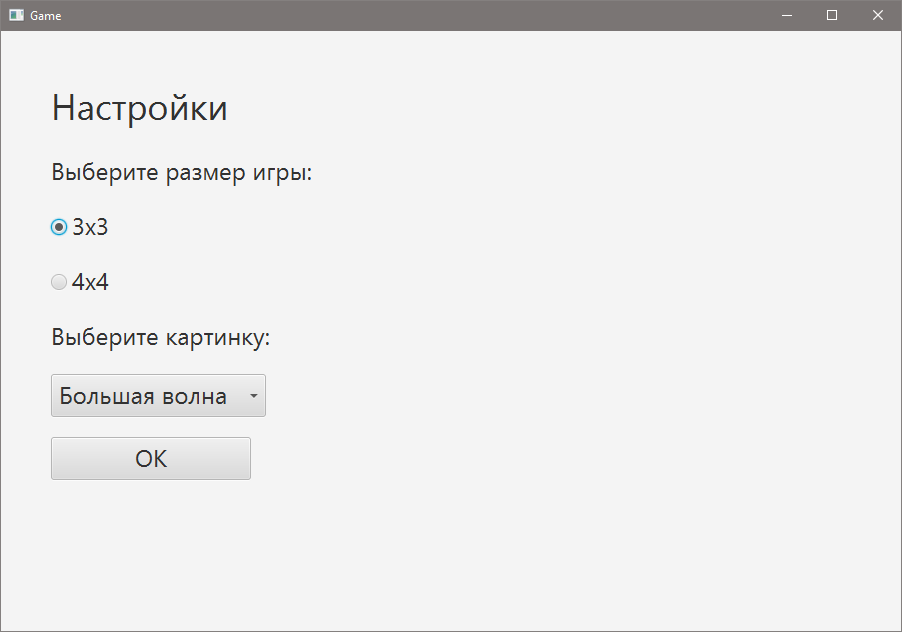
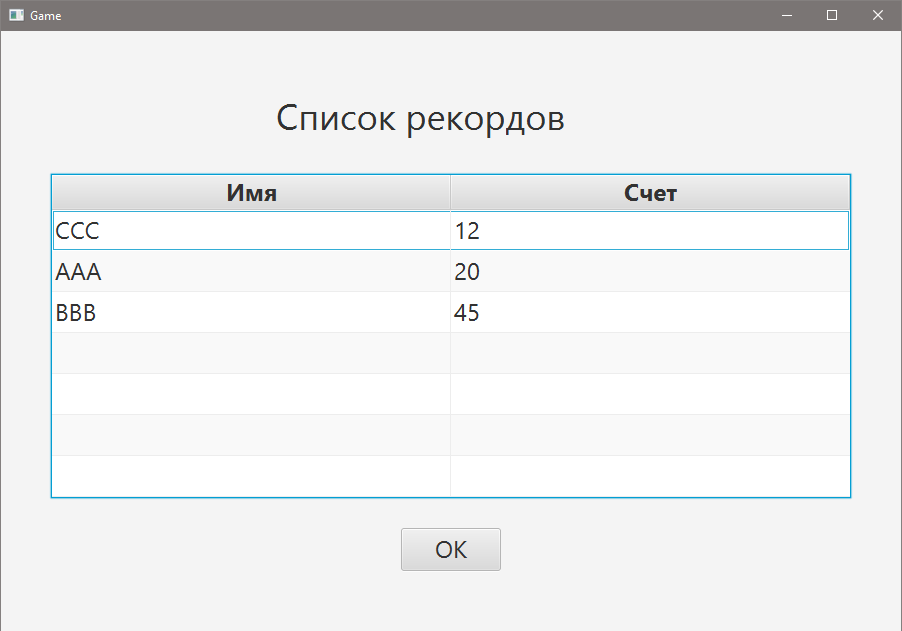

# fifteengame
Game "Fifteen" with settings (size of game, picture or numbers) and list of records.

Игра "Пятнашки" с меню, настройками игры (размер поля, выбор картинки или цифр), списком рекордов.
Использовалась Java 8 с платформой JavaFX в Netbeans IDE. Список рекордов в виде текстового документа хранится в проекте.

Скриншоты:

